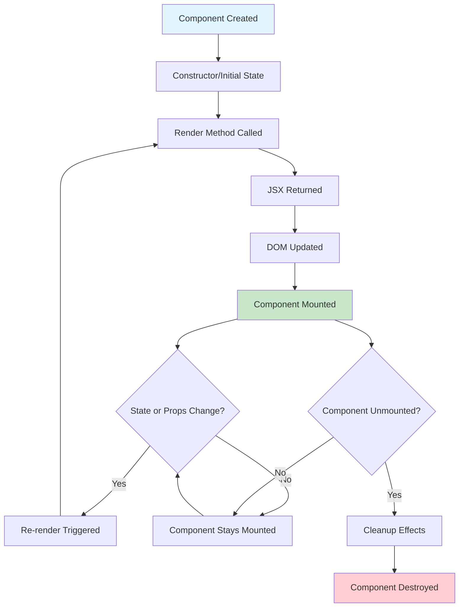

# Visual Learning Aids for React Concepts

## 🏗️ Component Architecture Diagram

```
📱 React Application Structure

┌─────────────────────────────────────────┐
│                App.tsx                   │  ← Root Component
│  ┌─────────────────────────────────────┐ │
│  │            Router Setup              │ │  
│  │  ┌─────────────────────────────────┐ │ │
│  │  │         Index.tsx               │ │ │  ← Main Page
│  │  │  ┌─────────────┐ ┌─────────────┐ │ │ │
│  │  │  │ DataUpload  │ │ Dashboard   │ │ │ │  ← Child Components
│  │  │  │             │ │             │ │ │ │
│  │  │  │ ┌─────────┐ │ │ ┌─────────┐ │ │ │ │
│  │  │  │ │ Button  │ │ │ │ Chart   │ │ │ │ │  ← Grandchild Components
│  │  │  │ │ Input   │ │ │ │ Table   │ │ │ │ │
│  │  │  │ └─────────┘ │ │ └─────────┘ │ │ │ │
│  │  │  └─────────────┘ └─────────────┘ │ │ │
│  │  └─────────────────────────────────┘ │ │
│  └─────────────────────────────────────┐ │
└─────────────────────────────────────────┘
```

---

## 🔄 Data Flow Visualization

```
📊 Props & State Flow

Parent Component (Index.tsx)
┌─────────────────────────────────────────┐
│  STATE: [data, setData] = useState([])   │
│  STATE: [fileName, setFileName] = ...    │
└─────────────┬───────────────────────────┘
              │ Props flowing DOWN ⬇️
              │ 
┌─────────────▼───────────────────────────┐
│        Child Component (DataUpload)      │
│                                         │
│  RECEIVES: onDataLoad={handleDataLoad}  │
│                                         │
│  ┌─────────────────────────────────┐    │
│  │ User uploads file 📁            │    │
│  │ Component processes data 🔄     │    │
│  │ Calls onDataLoad(data, name) 📤 │    │
│  └─────────────────────────────────┘    │
└─────────────┬───────────────────────────┘
              │ Function call flowing UP ⬆️
              │
┌─────────────▼───────────────────────────┐
│     Parent receives callback data       │
│                                         │
│  setData(loadedData) ← Updates state    │
│  setFileName(name)   ← Updates state    │
│                                         │
│  🔄 Component re-renders with new data  │
└─────────────────────────────────────────┘
```

---

## 🧠 State vs Props Comparison

```
🏠 React Data Management

STATE (Component's Memory)
┌─────────────────────────────┐
│  📝 Internal data           │
│  🔄 Can be changed          │  
│  🏠 Lives inside component  │
│  🎯 Controls behavior       │
│                             │
│  Examples:                  │
│  • Form input values       │
│  • Loading status          │
│  • Show/hide modal        │
│  • Current tab selection   │
└─────────────────────────────┘
              │
              │ setState()
              ▼
        ┌──────────┐
        │ RE-RENDER │
        └──────────┘

PROPS (Data from Parent)
┌─────────────────────────────┐
│  📨 External data           │
│  🔒 Read-only               │
│  👨‍👩‍👧‍👦 Comes from parent      │
│  📋 Configures component    │
│                             │
│  Examples:                  │
│  • User name to display    │
│  • API endpoint URL        │
│  • Callback functions      │
│  • Style configurations    │
└─────────────────────────────┘
```

---

## 📱 Component Lifecycle Flowchart



---

## 🎯 Event Handling Flow

```
👆 User Interaction to State Update

1. USER ACTION
   ┌─────────────────┐
   │  🖱️ User clicks   │
   │     button      │
   └─────────┬───────┘
             │
             ▼
2. EVENT HANDLER
   ┌─────────────────┐
   │ onClick={       │
   │   handleClick   │
   │ }               │
   └─────────┬───────┘
             │
             ▼
3. FUNCTION EXECUTION
   ┌─────────────────┐
   │ const handleClick│
   │ = () => {       │
   │   setCount(     │
   │     count + 1   │
   │   )             │
   │ }               │
   └─────────┬───────┘
             │
             ▼
4. STATE UPDATE
   ┌─────────────────┐
   │ React schedules │
   │ component       │
   │ re-render       │
   └─────────┬───────┘
             │
             ▼
5. RE-RENDER
   ┌─────────────────┐
   │ Component       │
   │ renders with    │
   │ new state       │
   └─────────────────┘
```

---

## 🧩 JSX Transformation Visual

```jsx
📝 What You Write (JSX):

const WelcomeMessage = ({ name, age }) => {
  return (
    <div className="welcome">
      <h1>Hello, {name}!</h1>
      <p>You are {age} years old.</p>
      <button onClick={handleClick}>
        Click me
      </button>
    </div>
  );
};
```

```jsx
🔄 What React Creates (JavaScript):

const WelcomeMessage = ({ name, age }) => {
  return React.createElement(
    "div",
    { className: "welcome" },
    React.createElement("h1", null, "Hello, ", name, "!"),
    React.createElement("p", null, "You are ", age, " years old."),
    React.createElement(
      "button", 
      { onClick: handleClick }, 
      "Click me"
    )
  );
};
```

---

## 📊 File Structure Mental Model

```
🏗️ Project Organization

src/
├── 🏠 App.tsx ...................... Main house (root component)
├── 📄 main.tsx .................... Front door (entry point)  
├── 🎨 index.css ................... Paint & decorations (styles)
├── 📁 pages/
│   ├── 🏠 Index.tsx ............... Living room (main page)
│   └── 🚫 NotFound.tsx ............ Basement (error page)
├── 📁 components/
│   ├── 📤 DataUpload.tsx .......... Kitchen (data preparation)
│   ├── 📊 Dashboard.tsx ........... Office (data analysis)
│   ├── 📈 ChartSection.tsx ........ Gallery (visualizations)
│   └── 📁 ui/ .................... Toolshed (reusable tools)
│       ├── 🔘 button.tsx
│       ├── 📋 card.tsx  
│       └── 📊 chart.tsx
├── 📁 types/
│   └── 📝 data.ts ................. Blueprint (type definitions)
└── 📁 utils/
    └── 🧮 dataAnalysis.ts ......... Workshop (utility functions)
```

---

## 🔄 Hook Usage Patterns

```jsx
🪝 Common React Hooks Visualization

// 1. STATE HOOK - Component Memory
const [count, setCount] = useState(0);
      ┌─────┐    ┌─────────┐
      │VALUE│    │FUNCTION │
      │     │    │TO UPDATE│  
      └─────┘    └─────────┘

// 2. EFFECT HOOK - Side Effects  
useEffect(() => {
  // Do something when component mounts/updates
  document.title = `Count: ${count}`;
  
  return () => {
    // Cleanup when component unmounts
    document.title = 'React App';
  };
}, [count]); // Dependencies array
   └─────┘
   When to run effect

// 3. CALLBACK HOOK - Performance
const handleClick = useCallback(() => {
  setCount(count + 1);
}, [count]);
   └─────┘
   Dependencies

// 4. MEMO HOOK - Expensive Calculations
const expensiveValue = useMemo(() => {
  return calculateSomethingExpensive(data);
}, [data]);
   └────┘
   Only recalculate when data changes
```

---

## 📱 Responsive Design Concept

```
📱💻🖥️ Responsive Breakpoints

Mobile First Design:

┌─────────────────┐  ← Base styles (mobile)
│   📱 < 768px    │    sm: min-width 640px
│                 │    md: min-width 768px  
│  Stack content  │    lg: min-width 1024px
│   vertically    │    xl: min-width 1280px
└─────────────────┘

┌─────────────────────────────┐  ← Tablet (md:)
│       💻 768px - 1024px     │
│                             │
│    Side-by-side content     │
│      Grid: 2 columns        │
└─────────────────────────────┘

┌─────────────────────────────────────────┐  ← Desktop (lg:)
│           🖥️ > 1024px                   │
│                                         │
│        Multiple columns layout          │
│         Grid: 3-4 columns               │
└─────────────────────────────────────────┘
```

---

## 🎨 CSS-in-JS with Tailwind Mental Model

```
🎨 Styling Approach

Traditional CSS:
.my-button {
  background-color: blue;
  color: white;
  padding: 8px 16px;
  border-radius: 4px;
  border: none;
}

Tailwind Utilities:
<button className="bg-blue-500 text-white px-4 py-2 rounded border-none">

Design System Approach:
<button className="bg-primary text-primary-foreground px-4 py-2 rounded border-none">
                   ↑                    ↑
            Uses CSS variables    Maintains consistency
            from index.css       across entire app
```

This visual guide helps students understand complex React concepts through diagrams, flowcharts, and visual representations that make abstract concepts concrete and memorable.